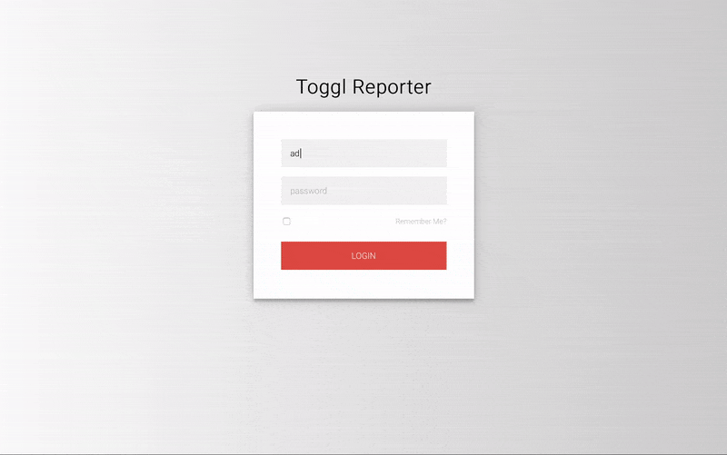

# toggl-reporter



Small SpringBoot, Vaadin-Application that stores fetched TimeEntries in a MongoDb and allows to perfrom more detailed reports then possible within toggl itself.

## usage

 * check configuration within application.properties - especially the mongo-db connection
 * afterwards run the application you will get asked for your api-token
 * the will get stored within mongodb and is used for any futher api-requests
 * to perform some reports you need to pull data from toggl via settings
 

## docker

I've provided an docker image to run this application: [rocketbaseio/toggl-reporter](https://hub.docker.com/r/rocketbaseio/toggl-reporter/)

You can simple run it like:
```shell
docker run -ti --rm -e SPRING_DATA_MONGODB_URI=mongodb://mongo/toggl-report -p 8080:8080 --link mongo:mongo rocketbaseio/toggl-reporter
```

## remarks

this is an initial version - no warranties etc...

