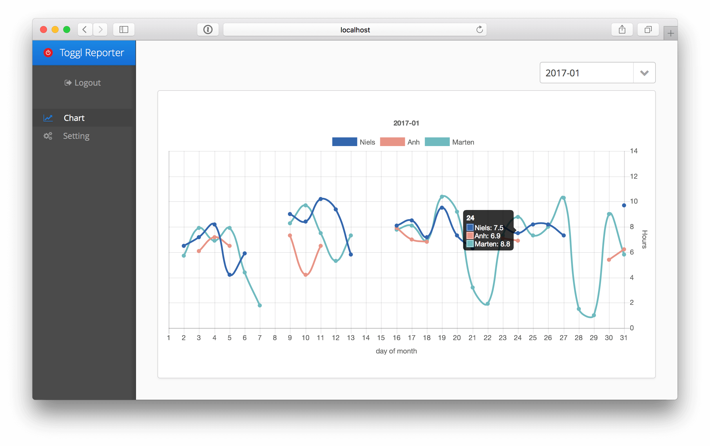

# toggl-reporter

Small SpringBoot, Vaadin-Application that stores fetched TimeEntries in a MongoDb and allows to perfrom more detailed reports then possible within toggl itself.

## usage

 * check configuration within application.properties - especially the mongo-db connection
 * afterwards run the application you will get asked for your api-token
 * the will get stored within mongodb and is used for any futher api-requests
 * to perform some reports you need to pull data from toggl via settings
 
## remarks

this is an initial version - no warranties etc...